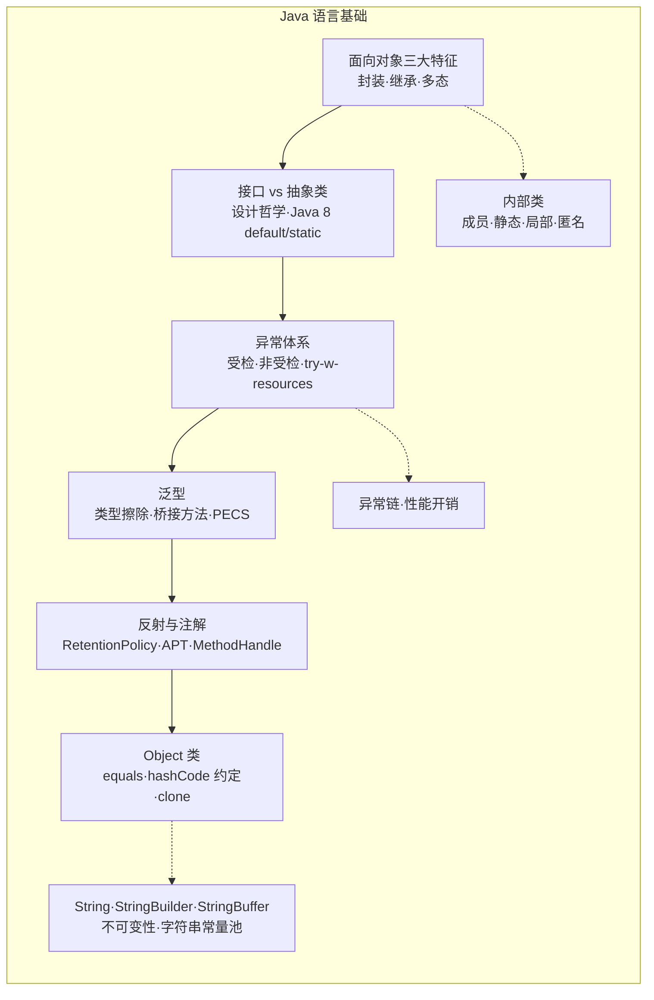

```mermaid
flowchart TB
    subgraph 基础核心["Java 语言基础"]
        direction TB
        A1["面向对象三大特征<br/>封装·继承·多态"] --> A2["接口 vs 抽象类<br/>设计哲学·Java 8 default/static"]
        A2 --> A3["异常体系<br/>受检·非受检·try-w-resources"]
        A3 --> A4["泛型<br/>类型擦除·桥接方法·PECS"]
        A4 --> A5["反射与注解<br/>RetentionPolicy·APT·MethodHandle"]
        A5 --> A6["Object 类<br/>equals·hashCode 约定·clone"]
        A1 -.-> A7["内部类<br/>成员·静态·局部·匿名"]
        A3 -.-> A8["异常链·性能开销"]
        A6 -.-> A9["String·StringBuilder·StringBuffer<br/>不可变性·字符串常量池"]
    end
```
