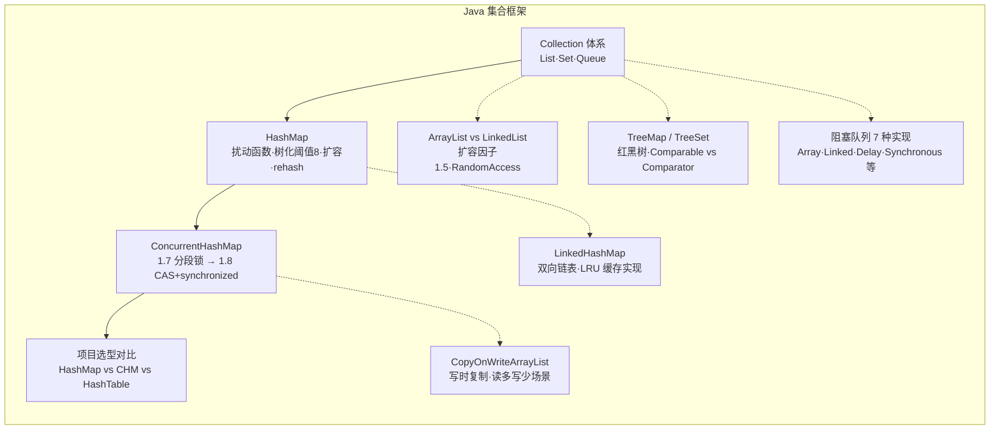

```mermaid
flowchart TB
    subgraph 集合框架["Java 集合框架"]
        direction TB
        B1["Collection 体系<br/>List·Set·Queue"] --> B2["HashMap<br/>扰动函数·树化阈值8·扩容·rehash"]
        B2 --> B3["ConcurrentHashMap<br/>1.7 分段锁 → 1.8 CAS+synchronized"]
        B3 --> B4["项目选型对比<br/>HashMap vs CHM vs HashTable"]
        B1 -.-> B5["ArrayList vs LinkedList<br/>扩容因子1.5·RandomAccess"]
        B1 -.-> B6["TreeMap / TreeSet<br/>红黑树·Comparable vs Comparator"]
        B2 -.-> B7["LinkedHashMap<br/>双向链表·LRU 缓存实现"]
        B1 -.-> B8["阻塞队列 7 种实现<br/>Array·Linked·Delay·Synchronous 等"]
        B3 -.-> B9["CopyOnWriteArrayList<br/>写时复制·读多写少场景"]
    end
```

