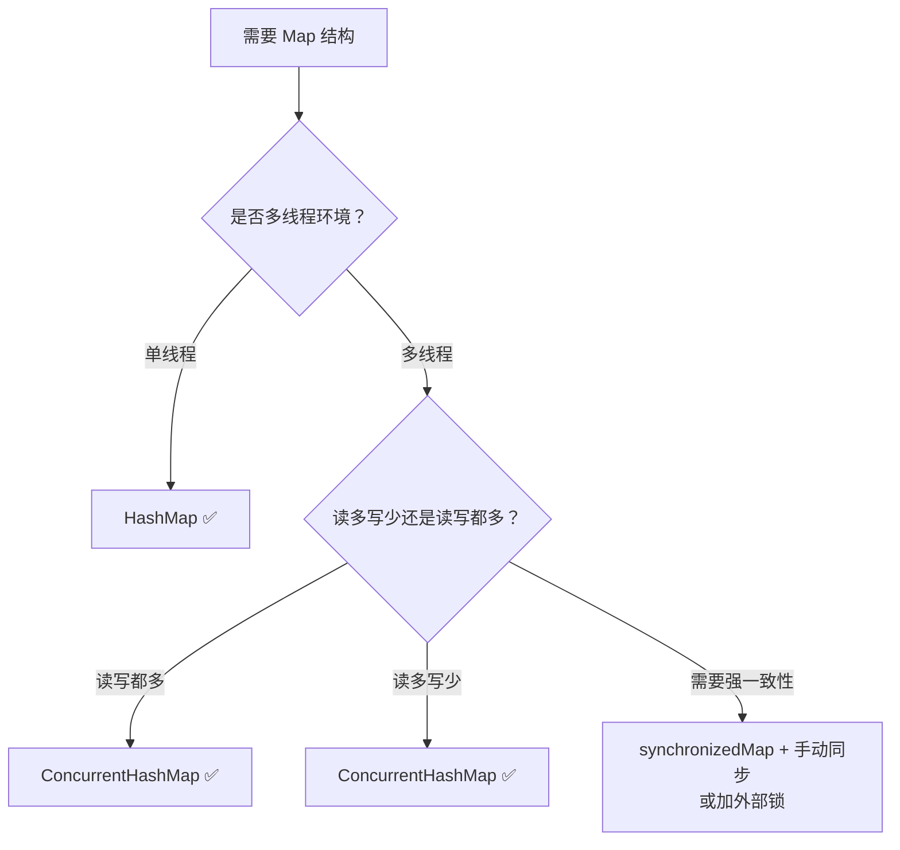

## HashTable vs HashMap vs CHM
设计思想对比->数据结构对比->锁机制对比->性能对比->功能特性对比->选型场景->高频面试题目->结论
### 设计思想对比
三个Map的定位
```
HashTable是1.0版本，最早的线程安全哈希表
HashMap是1.2版本，单线程最高性能的哈希表
CHM是1.5版本，高并发下线程安全的哈希表
```
### 数据结构对比
```java
// HashMap 1.8
// 数组 + 链表 + 红黑树
transient Node<K,V>[] table;
static class Node<K,V> {
    int hash;
    K key;
    V value;
    Node<K,V> next;
}
static final class TreeNode<K,V> extends Node<K,V> {
    TreeNode<K,V> parent, left, right, prev;
    boolean red;
}

// Hashtable（从未变过）
// 数组 + 链表（只有数组 + 链表，没有红黑树）
private transient Entry<?,?>[] table;
private static class Entry<K,V> {
    final int hash;
    final K key;
    V value;
    Entry<K,V> next;
}

// ConcurrentHashMap 1.8
// 数组 + 链表 + 红黑树（和 HashMap 1.8 一样）
transient volatile Node<K,V>[] table;
static class Node<K,V> {
    final int hash;
    final K key;
    volatile V val;        // volatile 保证可见性
    volatile Node<K,V> next;
}
```
### 锁机制对比
锁粒度
```java
// HashMap —— 无锁
Map<String, String> map = new HashMap<>();
map.put("key", "value");  // 没有任何锁，线程不安全

// Hashtable —— 全表锁
public synchronized V put(K key, V value) { ... }
public synchronized V get(Object key) { ... }
// 读和写都是同一把锁，读和读也互斥！

// ConcurrentHashMap 1.7 —— 分段锁
// 16 个 Segment，每个 Segment 一把锁（ReentrantLock）
// 写不同 Segment 可以并行，读无锁

// ConcurrentHashMap 1.8 —— CAS + 桶锁
// 空位用 CAS 无锁，非空位锁桶头节点（synchronized）
// 读完全无锁
```
锁性能对比
```
// 假设 16 个线程同时写
// Hashtable：16 个线程排队，一次只能 1 个写
// CHM 1.7：16 个线程可以同时写 16 个不同的 Segment
// CHM 1.8：16 个线程可以同时写 16 个不同的桶

// 随着数组扩容，CHM 1.8 的并发度会越来越高
// 初始 16 个桶 → 扩容后 32 个桶 → 并发度翻倍
```
### 性能对比
读写性能

| 操作     | HashTable | HashMap | CHM       |
| ------ | --------- | ------- | --------- |
| 单线程put | 慢 加锁      | 最快      | 接近HahsMap |
| 多线程put | 慢 串行      | 不安全     | 快 并行      |
| 单线程get | 慢 加锁      | 最快      | 接近HashMap |
| 多线程get | 慢 加锁      | 不安全     | 快 无锁      |
| 扩容开销   | 单线程扩容     | 单线程扩容   | 多线程并发扩容   |
实际测试数据
```
// 8 线程并发写 100 万次
// Hashtable：约 5000ms
// ConcurrentHashMap：约 200ms
// HashMap：线程不安全，数据丢失/死循环

// 8 线程并发读 100 万次
// Hashtable：约 3000ms（读也要锁）
// ConcurrentHashMap：约 50ms（无锁读）
```
### 功能特性对比
#### HashTable遗留的问题
```java
// ① 命名不规范
// HashMap 和 Hashtable —— 一个首字母大写，一个不是

// ② 构造器参数不同
Hashtable(int initialCapacity)  // 直接指定容量
HashMap(int initialCapacity)    // 自动转为 2 的幂次方

// ③ 迭代器不同
// Hashtable 的 Enumeration 是 fail-safe（不抛异常）
// HashMap 的 Iterator 是 fail-fast（抛 ConcurrentModificationException）

// ④ 继承的父类不同
Hashtable extends Dictionary    // Dictionary 是抽象类，已废弃
HashMap extends AbstractMap     // AbstractMap 是标准实现
```
#### null处理
```
// HashMap：允许一个 null key 和多个 null value
Map<String, String> hashMap = new HashMap<>();
hashMap.put(null, "value");    // ✅ 允许
hashMap.put("key", null);      // ✅ 允许

// Hashtable：不允许 null key 和 null value
Map<String, String> hashtable = new Hashtable<>();
hashtable.put(null, "value");  // ❌ NullPointerException
hashtable.put("key", null);    // ❌ NullPointerException

// ConcurrentHashMap：不允许 null key 和 null value
Map<String, String> chm = new ConcurrentHashMap<>();
chm.put(null, "value");        // ❌ NullPointerException
chm.put("key", null);          // ❌ NullPointerException
```
#### 迭代器
```
// HashMap —— fail-fast（快速失败）
Map<String, String> map = new HashMap<>();
map.put("A", "1");
map.put("B", "2");
//增强for循环，反编译之后也是使用Iterator遍历，Iterator创建时记录了当时的modCount到expectedModCOunt,如果修改了结构会导致modCount自增，导致next()时抛异常。
//1.put新的key、remove、clear  结构会变化
//2.put原有的key、replace(key,old,new)  结构不变，不会导致 modCount自增
for (String key : map.keySet()) {
    map.put("C", "3");  // ❌ ConcurrentModificationException！
}

// Hashtable —— fail-safe（安全失败）
// 迭代时不会抛异常，但也不保证读到最新数据

// ConcurrentHashMap —— 弱一致性
// 迭代时不会抛异常，但迭代器创建后修改的数据不一定能读到
// 适合读多写少的场景
CHM不存expectedModCount,也不检查ModCount,从头到尾扫table数组，不依赖快照和修改计数，靠的是volatile和节点不可变结构，当修改了结构会发生什么，如果是没扫过的桶，会被扫到，如果是已扫过的，就读不到了。迭代器只能单线程使用，不能多个线程共享，但多个线程互不干扰
```
#### 初始容量与扩容
```
// HashMap
// 默认容量：16
// 扩容：2 倍
// 阈值：capacity * 0.75

// Hashtable
// 默认容量：11（不是 2 的幂！）
// 扩容：2 倍 + 1（old * 2 + 1）
// 取模：用 % 不是位运算（因为容量不是 2 的幂）

// ConcurrentHashMap
// 默认容量：16
// 扩容：2 倍
// 扩容方式：多线程并发扩容
```
### 选型场景

实际项目中的选型建议
```java
// 场景 1：本地缓存（读多写少）
// ✅ ConcurrentHashMap
Map<String, Object> cache = new ConcurrentHashMap<>();

// 场景 2：方法内局部变量（单线程）
// ✅ HashMap
Map<String, String> localMap = new HashMap<>();

// 场景 3：全局配置，初始化后只读
// ✅ ConcurrentHashMap（安全，且读无锁）
Map<String, String> config = new ConcurrentHashMap<>();

// 场景 4：遗留系统，需要兼容旧代码
// ⚠️ 尽量迁移到 ConcurrentHashMap

// 场景 5：需要排序
// ✅ TreeMap 或 ConcurrentSkipListMap
```
### 高频面试题目
#### 题目1：为什么HashTable被淘汰了？
```
// ① 全表锁，并发性能极差
// ② 命名不规范
// ③ 继承 Dictionary（已废弃）
// ④ 容量不是 2 的幂，不能用位运算优化
// ⑤ 迭代器是 fail-safe，不能及时发现问题
// ⑥ 没有 null 支持

// 一句话：ConcurrentHashMap 是 Hashtable 的全面升级版
```
题目2：HashMap和CHM在并发下的区别？
```
// HashMap 并发下：
// ① 死循环（1.7 头插法 + 扩容）
// ② 数据丢失（两个线程同时 put 覆盖）
// ③ size 不准

// CHM 并发下：
// ① 不会死循环
// ② 不会丢数据
// ③ size 准确（虽然弱一致性，但不丢数据）
// ④ 读无锁，写只锁桶
```
#### 题目3：为什么CHM的get(key)无锁？
```
// ① Node 的 val 和 next 都是 volatile 的
//    volatile 保证：写操作对其他线程立即可见

// ② put 操作在 synchronized 块中完成
//    锁释放时，所有修改会刷新到主内存

// ③ 扩容时用 ForwardingNode 标记
//    get 看到 ForwardingNode 就去新数组找

// 所以：get 不需要加锁，volatile 保证可见性
```
#### 题目4：三个Map的迭代器有什么区别
| Map                   | 迭代器类型                  | 遍历时修改会怎样                            |
| --------------------- | ---------------------- | ----------------------------------- |
| **HashMap**           | fail-fast              | 抛 `ConcurrentModificationException` |
| **Hashtable**         | fail-safe（Enumeration） | 不抛异常，但结果不确定                         |
| **ConcurrentHashMap** | 弱一致性                   | 不抛异常，不保证读到最新数据                      |
#### 题目5：哪些场景不能用CHM代替HahsMap?
```java
// ① 需要 null key
Map<String, String> map = new HashMap<>();
map.put(null, "value");  // ✅ HashMap 允许

Map<String, String> chm = new ConcurrentHashMap<>();
chm.put(null, "value");  // ❌ NPE

// ② 需要强一致性
// CHM 是弱一致性的，get 可能拿不到刚 put 的值
// 如果业务要求"写入后必须立即读到"，需要加额外锁

// ③ 单线程性能极致优化
// HashMap 在单线程下比 CHM 快 10-20%
// 如果确定是单线程，用 HashMap
```
