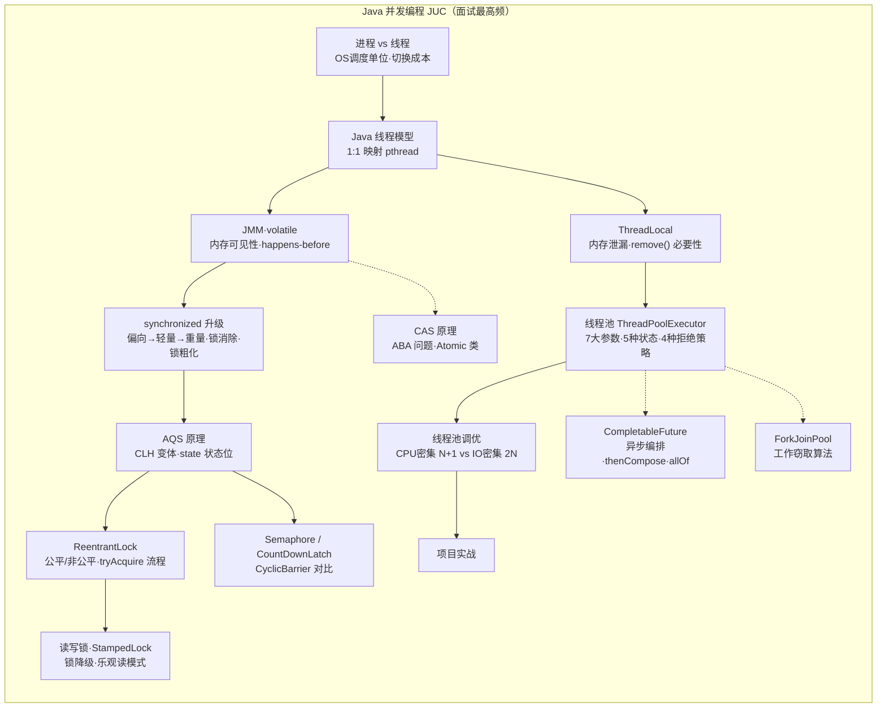

```mermaid
flowchart TB
    subgraph 并发编程["Java 并发编程 JUC（面试最高频）"]
        direction TB
        C1["进程 vs 线程<br/>OS调度单位·切换成本"] --> C2["Java 线程模型<br/>1:1 映射 pthread"]
        C2 --> C3["JMM·volatile<br/>内存可见性·happens-before"]
        C3 --> C4["synchronized 升级<br/>偏向→轻量→重量·锁消除·锁粗化"]
        C4 --> C5["AQS 原理<br/>CLH 变体·state 状态位"]
        C5 --> C6["ReentrantLock<br/>公平/非公平·tryAcquire 流程"]
        C6 --> C7["读写锁·StampedLock<br/>锁降级·乐观读模式"]
        C5 --> C8["Semaphore / CountDownLatch<br/>CyclicBarrier 对比"]
        C2 --> C9["ThreadLocal<br/>内存泄漏·remove() 必要性"]
        C9 --> C10["线程池 ThreadPoolExecutor<br/>7大参数·5种状态·4种拒绝策略"]
        C10 --> C11["线程池调优<br/>CPU密集 N+1 vs IO密集 2N"]
        C11 --> C12["项目实战"]
        C10 -.-> C13["CompletableFuture<br/>异步编排·thenCompose·allOf"]
        C10 -.-> C14["ForkJoinPool<br/>工作窃取算法"]
        C3 -.-> C15["CAS 原理<br/>ABA 问题·Atomic 类"]
    end
```

