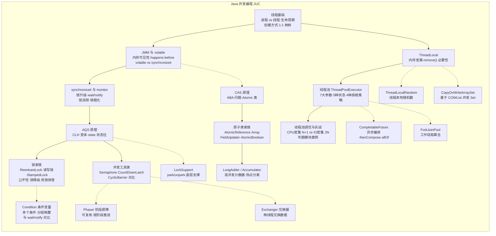

```mermaid
flowchart TB
    subgraph 并发编程["Java 并发编程 JUC"]
        direction TB
        C1["线程基础<br/>进程 vs 线程·生命周期<br/>创建方式·1:1 映射"] --> C2["JMM 与 volatile<br/>内存可见性·happens-before<br/>volatile vs synchronized"]
        C2 --> C3["synchronized 与 monitor<br/>锁升级·wait/notify<br/>锁消除·锁粗化"]
        C3 --> C4["AQS 原理<br/>CLH 变体·state 状态位"]
        C4 --> C5["锁家族<br/>ReentrantLock·读写锁·StampedLock<br/>公平性·锁降级·死锁排查"]
        C4 --> C6["并发工具类<br/>Semaphore·CountDownLatch<br/>CyclicBarrier 对比"]
        C1 --> C7["ThreadLocal<br/>内存泄漏·remove() 必要性"]
        C7 --> C8["线程池 ThreadPoolExecutor<br/>7大参数·5种状态·4种拒绝策略"]
        C8 --> C9["线程池调优与实战<br/>CPU密集 N+1 vs IO密集 2N<br/>判题模块案例"]
        C8 -.-> C10["CompletableFuture<br/>异步编排·thenCompose·allOf"]
        C8 -.-> C11["ForkJoinPool<br/>工作窃取算法"]
        C2 -.-> C12["CAS 原理<br/>ABA 问题·Atomic 类"]

        C12 --> A1["原子类家族<br/>AtomicReference·Array<br/>FieldUpdater·AtomicBoolean"]
        A1 --> A2["LongAdder / Accumulator<br/>高并发计数器·热点分离"]
        C4 -.-> A3["LockSupport<br/>park/unpark 底层支撑"]
        C5 -.-> A4["Condition 条件变量<br/>多个条件·分组唤醒<br/>与 wait/notify 对比"]
        C6 -.-> A5["Phaser 阶段屏障<br/>可复用·按阶段推进"]
        C6 -.-> A6["Exchanger 交换器<br/>两线程交换数据"]
        C7 -.-> A7["ThreadLocalRandom<br/>线程本地随机数"]
        C7 -.-> A8["CopyOnWriteArraySet<br/>基于 COWList 并发 Set"]
    end
```

