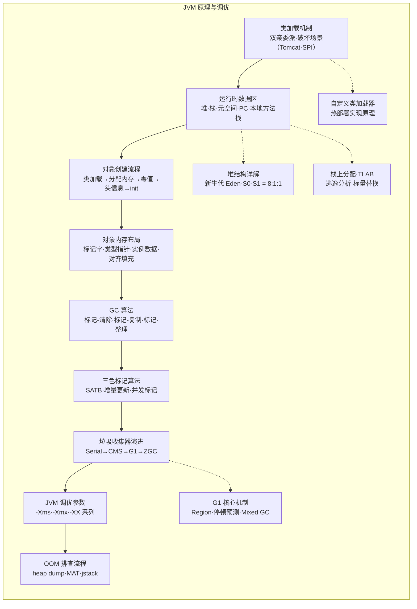

```mermaid
flowchart TB
    subgraph JVM["JVM 原理与调优"]
        direction TB
        D1["类加载机制<br/>双亲委派·破坏场景（Tomcat·SPI）"] --> D2["运行时数据区<br/>堆·栈·元空间·PC·本地方法栈"]
        D2 --> D3["对象创建流程<br/>类加载→分配内存→零值→头信息→init"]
        D3 --> D4["对象内存布局<br/>标记字·类型指针·实例数据·对齐填充"]
        D4 --> D5["GC 算法<br/>标记-清除·标记-复制·标记-整理"]
        D5 --> D6["三色标记算法<br/>SATB·增量更新·并发标记"]
        D6 --> D7["垃圾收集器演进<br/>Serial→CMS→G1→ZGC"]
        D7 --> D8["JVM 调优参数<br/>-Xms·-Xmx·-XX 系列"]
        D8 --> D9["OOM 排查流程<br/>heap dump·MAT·jstack"]
        D2 -.-> D10["堆结构详解<br/>新生代 Eden·S0·S1 = 8:1:1"]
        D2 -.-> D11["栈上分配·TLAB<br/>逃逸分析·标量替换"]
        D7 -.-> D12["G1 核心机制<br/>Region·停顿预测·Mixed GC"]
        D1 -.-> D13["自定义类加载器<br/>热部署实现原理"]
    end
```

