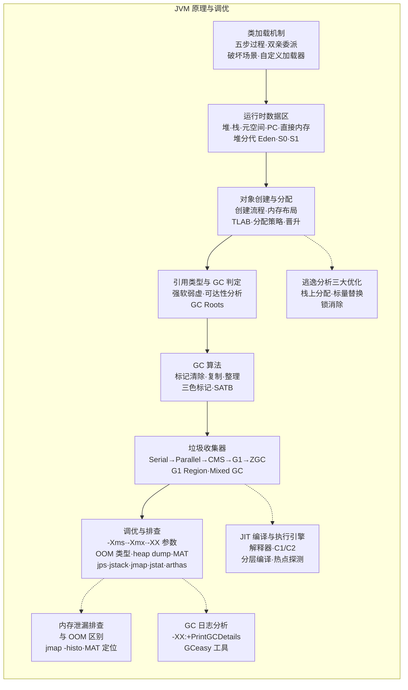

```mermaid
flowchart TB
    subgraph JVM["JVM 原理与调优"]
        direction TB
        D1["类加载机制<br/>五步过程·双亲委派<br/>破坏场景·自定义加载器"] --> D2["运行时数据区<br/>堆·栈·元空间·PC·直接内存<br/>堆分代 Eden·S0·S1"]
        D2 --> D3["对象创建与分配<br/>创建流程·内存布局<br/>TLAB·分配策略·晋升"]
        D3 --> D4["引用类型与 GC 判定<br/>强软弱虚·可达性分析<br/>GC Roots"]
        D4 --> D5["GC 算法<br/>标记清除·复制·整理<br/>三色标记·SATB"]
        D5 --> D6["垃圾收集器<br/>Serial→Parallel→CMS→G1→ZGC<br/>G1 Region·Mixed GC"]
        D6 --> D7["调优与排查<br/>-Xms·-Xmx·-XX 参数<br/>OOM 类型·heap dump·MAT<br/>jps·jstack·jmap·jstat·arthas"]

        D7 -.-> N1["内存泄漏排查<br/>与 OOM 区别<br/>jmap -histo·MAT 定位"]
        D3 -.-> N2["逃逸分析三大优化<br/>栈上分配·标量替换<br/>锁消除"]
        D6 -.-> N3["JIT 编译与执行引擎<br/>解释器·C1/C2<br/>分层编译·热点探测"]
        D7 -.-> N4["GC 日志分析<br/>-XX:+PrintGCDetails<br/>GCeasy 工具"]
    end
```

