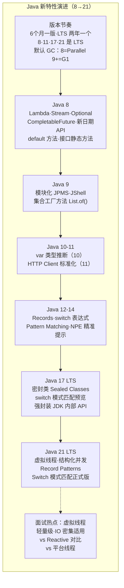

```mermaid
flowchart TB
    subgraph 新特性["Java 新特性演进（8→21）"]
        direction TB
        E0["版本节奏<br/>6个月一版·LTS 两年一个<br/>8·11·17·21 是 LTS<br/>默认 GC：8=Parallel 9+=G1"]
        E0 --> E1["Java 8<br/>Lambda·Stream·Optional<br/>CompletableFuture·新日期API<br/>default 方法·接口静态方法"]
        E1 --> E2["Java 9<br/>模块化 JPMS·JShell<br/>集合工厂方法 List.of()"]
        E2 --> E3["Java 10-11<br/>var 类型推断（10）<br/>HTTP Client 标准化（11）"]
        E3 --> E4["Java 12-14<br/>Records·switch 表达式<br/>Pattern Matching·NPE 精准提示"]
        E4 --> E5["Java 17 LTS<br/>密封类 Sealed Classes<br/>switch 模式匹配预览<br/>强封装 JDK 内部 API"]
        E5 --> E6["Java 21 LTS<br/>虚拟线程·结构化并发<br/>Record Patterns<br/>Switch 模式匹配正式版"]
        E6 -.-> E7["面试热点：虚拟线程<br/>轻量级·IO 密集适用<br/>vs Reactive 对比<br/>vs 平台线程"]
    end
```
