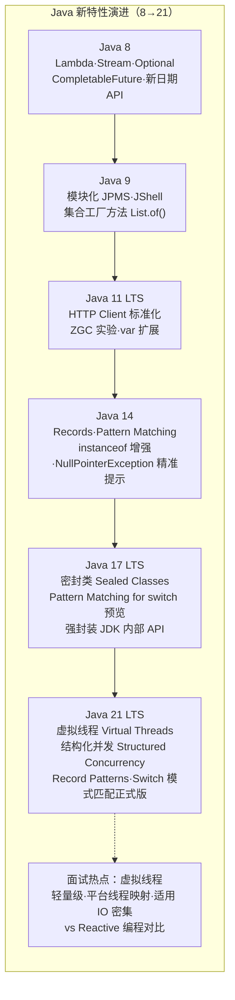

```mermaid
flowchart TB
    subgraph 新特性["Java 新特性演进（8→21）"]
        direction TB
        E1["Java 8<br/>Lambda·Stream·Optional<br/>CompletableFuture·新日期API"] --> E2["Java 9<br/>模块化 JPMS·JShell<br/>集合工厂方法 List.of()"]
        E2 --> E3["Java 11 LTS<br/>HTTP Client 标准化<br/>ZGC 实验·var 扩展"]
        E3 --> E4["Java 14<br/>Records·Pattern Matching<br/>instanceof 增强·NullPointerException 精准提示"]
        E4 --> E5["Java 17 LTS<br/>密封类 Sealed Classes<br/>Pattern Matching for switch 预览<br/>强封装 JDK 内部 API"]
        E5 --> E6["Java 21 LTS<br/>虚拟线程 Virtual Threads<br/>结构化并发 Structured Concurrency<br/>Record Patterns·Switch 模式匹配正式版"]
        E6 -.-> E7["面试热点：虚拟线程<br/>轻量级·平台线程映射·适用 IO 密集<br/>vs Reactive 编程对比"]
    end
```
